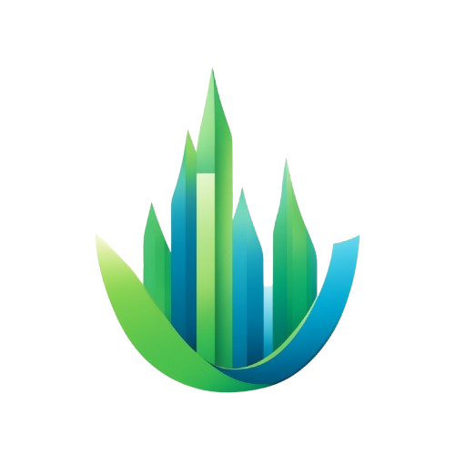

# Welcome to Daytistics

Daytistics is a free and open-source producitvity tool that helps you to track your daily activities and well-being. It is designed to help you to reflect on your day and to improve your productivity. It's built with modern technologies like Django and Nuxt and places great value on user experience.

Let our features convince you:

- Activity Tracker: Track your activities by time
- Well-Being Tracker: Keep an eye on your well-being
- Digital Diary: Create short diary entries
- Visualization: Visualize connections between your well-being and your activities
- Receive Suggestions: Learn how to make your day more productive
- Self-Hosting: Privacy is important to you? Host Daytistics on your own server!

## 🔥 Start Right Now

- **Managed-Hosting**: Register on [daytistics.com](https://daytistics.com/) and start right away.
- **Self-Hosting**: You can host Daytistics on your own server. Just follow the instructions in the [documentation](./self-hosting.md).

## 📖 Documentation

We have a detailed documentation that explains all the features of Daytistics for users and developers. You can find the documentation at [docs.daytistics.com](https://docs.daytistics.com/).

## ❤️ Contributing & Support

Contributions are welcome! If you want to contribute to the project check out the [Become a Contributor](./developers/become-a-contributer.md) section in our [docs](https://docs.daytistics.com).

If you are not a programmer, you can still contribute financially. Financial contributions help us prioritize our work on this project over others and show us that there is a real need for project development. You can donate to us via [Polar.sh](https://polar.sh/daytistics/).

## 🗯️ Communication

Consider joining our [discord](http://discord.daytistics.com/) to stay up-to-date on events, updates, and connect with other members. Our discord is also a great place to find help if you have any problems with our software.

## ⚖️ License

[Daytistics](https://daytistics.com/) &copy; 2024-present by Leo Gall and the contributors of the Daytistics project is licensed under the [European Union Public Licence](https://joinup.ec.europa.eu/collection/eupl).
